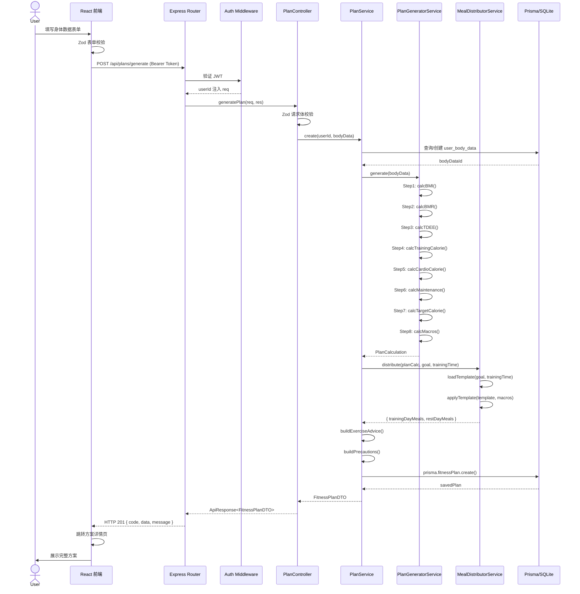
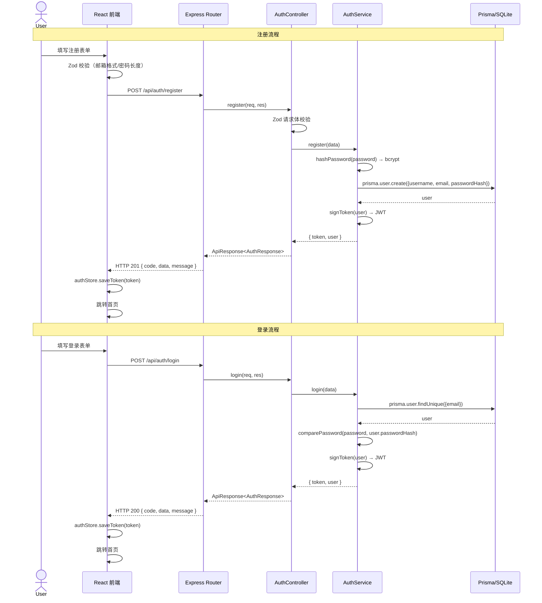
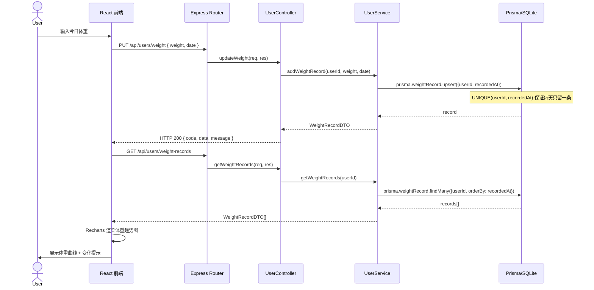
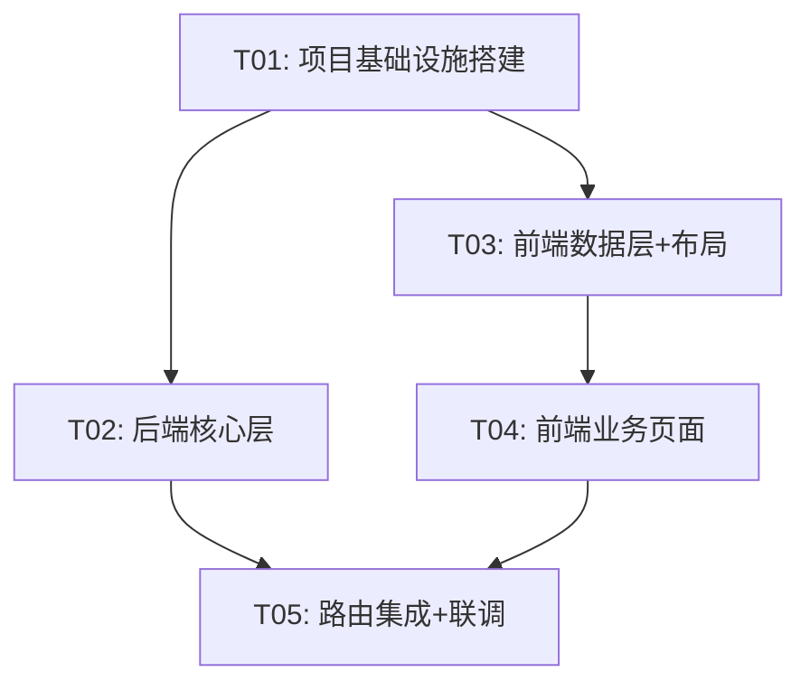

# FitPlan 系统架构设计文档

> 架构师：Bob | 版本：1.0 | 日期：2025-07-11

---

## 1. 实现方案与框架选型

### 1.1 核心技术挑战

| # | 挑战 | 应对策略 |
|---|------|----------|
| C1 | 14种方案 × 每餐分配逻辑复杂 | 后端 Service 层封装 `PlanGenerator`，按「目标 × 时段」查表计算，分配数据以 JSON 结构存储在 seed 数据中 |
| C2 | 9种力量预测公式复用性 | 后端 `StrengthPredictor` 类统一接口，9种公式各自实现，前端只需传参调用 |
| C3 | 体重每天只保留一条记录 | 数据库 UNIQUE(user_id, recorded_at)，upsert 语义 |
| C4 | 14种方案每餐分配数据结构化 | 定义 TypeScript `MealPlan` 接口，以 JSON 字段存入 `fitness_plans` 表 |
| C5 | 开发/生产数据库切换 | Prisma 多 schema + dotenv 环境变量切换 provider |

### 1.2 框架选型与版本

| 层级 | 技术 | 版本 | 选型理由 |
|------|------|------|----------|
| **前端构建** | Vite | ^5.4.0 | 极速 HMR，原生 TS 支持 |
| **前端框架** | React | ^18.3.0 | 生态成熟，PRD 指定 |
| **前端语言** | TypeScript | ^5.5.0 | 类型安全，严格模式 |
| **UI 组件库** | MUI | ^5.16.0 | 复杂组件（表格、对话框、日期选择器等） |
| **CSS 框架** | TailwindCSS | ^3.4.0 | 布局与样式，与 MUI 互补 |
| **路由** | React Router | ^6.26.0 | 声明式路由，懒加载支持 |
| **状态管理** | Zustand | ^4.5.0 | 轻量，比 Redux 简洁，适合中等项目 |
| **HTTP 客户端** | Axios | ^1.7.0 | 拦截器支持 JWT 自动附加 |
| **图表** | Recharts | ^2.12.0 | React 原生，体重趋势图 |
| **表单校验** | React Hook Form + Zod | ^7.52 / ^3.23 | 类型安全的表单校验 |
| **后端框架** | Express | ^4.21.0 | PRD 指定，轻量灵活 |
| **后端语言** | TypeScript | ^5.5.0 | 前后端类型共享 |
| **ORM** | Prisma | ^5.19.0 | 类型安全，多数据库 provider 支持 |
| **认证** | jsonwebtoken + bcryptjs | ^9.0 / ^2.4 | JWT 签发 + 密码哈希 |
| **校验** | Zod | ^3.23.0 | 前后端共享校验 schema |
| **数据库(开发)** | SQLite | - | 零配置，本地开发 |
| **数据库(生产)** | PostgreSQL | ^16 | 生产级关系数据库 |

### 1.3 架构模式

```
前端：SPA + 客户端路由（React Router）
后端：分层架构（Controller → Service → Repository/Prisma）
通信：RESTful API + JWT Bearer Token
```

---

## 2. 文件列表及相对路径

### 2.1 后端文件（server/）

```
server/
├── package.json
├── tsconfig.json
├── .env
├── .env.example
├── prisma/
│   ├── schema.prisma                    # 数据库 Schema 定义
│   ├── seed.ts                          # 数据初始化脚本
│   └── migrations/                      # Prisma 迁移文件（自动生成）
├── src/
│   ├── index.ts                         # 应用入口，Express 启动
│   ├── app.ts                           # Express 应用配置（中间件、路由挂载）
│   ├── config/
│   │   └── index.ts                     # 环境变量与配置
│   ├── middlewares/
│   │   ├── auth.ts                      # JWT 认证中间件
│   │   ├── errorHandler.ts              # 全局错误处理中间件
│   │   └── validate.ts                  # Zod 校验中间件
│   ├── routes/
│   │   ├── auth.routes.ts               # 认证路由
│   │   ├── user.routes.ts               # 用户路由
│   │   ├── plan.routes.ts               # 方案路由
│   │   ├── training.routes.ts           # 训练路由
│   │   ├── knowledge.routes.ts          # 科普路由
│   │   └── admin.routes.ts              # 管理后台路由
│   ├── controllers/
│   │   ├── auth.controller.ts           # 认证控制器
│   │   ├── user.controller.ts           # 用户控制器
│   │   ├── plan.controller.ts           # 方案控制器
│   │   ├── training.controller.ts       # 训练控制器
│   │   ├── knowledge.controller.ts      # 科普控制器
│   │   └── admin.controller.ts          # 管理后台控制器
│   ├── services/
│   │   ├── auth.service.ts              # 认证服务（注册/登录/token）
│   │   ├── user.service.ts              # 用户服务
│   │   ├── plan.service.ts              # 方案服务（CRUD）
│   │   ├── plan-generator.service.ts    # 方案生成核心算法
│   │   ├── meal-distributor.service.ts  # 每餐分配计算
│   │   ├── training.service.ts          # 训练服务
│   │   ├── strength-predictor.service.ts # 力量预测（9种公式）
│   │   ├── knowledge.service.ts         # 科普服务
│   │   └── admin.service.ts             # 管理后台服务
│   ├── validators/
│   │   ├── auth.validator.ts            # 认证请求校验 schema
│   │   ├── user.validator.ts            # 用户请求校验 schema
│   │   ├── plan.validator.ts            # 方案请求校验 schema
│   │   └── training.validator.ts        # 训练请求校验 schema
│   └── types/
│       ├── express.d.ts                 # Express 类型扩展
│       └── index.ts                     # 共享类型定义
└── data/
    ├── meal-templates/
    │   ├── fat-loss.json                # 减脂8种方案每餐分配模板
    │   └── muscle-gain.json             # 增肌6种方案每餐分配模板
    ├── protein-quotas.json              # 蛋白质配额表
    ├── foods.json                       # 食物营养率初始数据
    ├── qa-articles.json                 # 问答数据
    ├── training-plans.json              # 训练计划初始数据
    └── stretch-anatomy.json             # 拉伸与解剖数据
```

### 2.2 前端文件（client/）

```
client/
├── package.json
├── tsconfig.json
├── tsconfig.node.json
├── vite.config.ts
├── tailwind.config.ts
├── postcss.config.js
├── index.html
├── public/
│   └── favicon.ico
└── src/
    ├── main.tsx                         # React 入口
    ├── App.tsx                          # 根组件 + 路由配置
    ├── vite-env.d.ts
    ├── api/
    │   ├── client.ts                    # Axios 实例 + 拦截器
    │   ├── auth.ts                      # 认证 API
    │   ├── user.ts                      # 用户 API
    │   ├── plan.ts                      # 方案 API
    │   ├── training.ts                  # 训练 API
    │   ├── knowledge.ts                 # 科普 API
    │   └── admin.ts                     # 管理后台 API
    ├── stores/
    │   ├── authStore.ts                 # 认证状态（Zustand）
    │   └── uiStore.ts                   # UI 状态（snackbar、loading 等）
    ├── hooks/
    │   ├── useAuth.ts                   # 认证 hook
    │   └── usePlans.ts                  # 方案 hook
    ├── types/
    │   └── index.ts                     # 前端类型定义
    ├── components/
    │   ├── layout/
    │   │   ├── AppLayout.tsx            # 全局布局（Navbar + Content）
    │   │   ├── Navbar.tsx               # 顶部导航栏
    │   │   ├── Footer.tsx               # 底部栏
    │   │   └── MobileMenu.tsx           # 移动端汉堡菜单
    │   ├── common/
    │   │   ├── LoadingSpinner.tsx        # 加载动画
    │   │   ├── ProtectedRoute.tsx        # 路由守卫
    │   │   ├── AdminRoute.tsx            # 管理员路由守卫
    │   │   ├── ConfirmDialog.tsx         # 确认对话框（MUI）
    │   │   └── ErrorBoundary.tsx         # 错误边界
    │   ├── plan/
    │   │   ├── StepForm.tsx             # 分步表单容器
    │   │   ├── BasicDataStep.tsx        # Step1: 基础数据
    │   │   ├── TrainingConfigStep.tsx   # Step2: 训练配置
    │   │   ├── ConfirmStep.tsx          # Step3: 确认生成
    │   │   ├── PlanCard.tsx             # 方案摘要卡片
    │   │   ├── MealTable.tsx            # 每餐营养表格
    │   │   └── NutritionSummary.tsx     # 营养素汇总
    │   ├── training/
    │   │   ├── TrainingPlanCard.tsx     # 训练计划卡片
    │   │   ├── ExerciseList.tsx         # 动作列表
    │   │   └── StrengthCalculator.tsx   # 力量预测计算器
    │   ├── knowledge/
    │   │   ├── QACard.tsx               # 问答卡片
    │   │   ├── FoodTable.tsx            # 食物营养表格（MUI Table）
    │   │   └── StretchAnatomyViewer.tsx # 拉伸/解剖图查看器
    │   ├── profile/
    │   │   ├── BodyDataForm.tsx         # 身体数据编辑表单
    │   │   ├── WeightRecorder.tsx       # 体重记录输入
    │   │   └── WeightChart.tsx          # 体重趋势图（Recharts）
    │   └── admin/
    │       ├── UserTable.tsx            # 用户列表（MUI Table）
    │       ├── UserDetailDialog.tsx      # 用户详情对话框（MUI Dialog）
    │       └── StatsPanel.tsx           # 统计面板
    ├── pages/
    │   ├── HomePage.tsx                 # 首页
    │   ├── LoginPage.tsx                # 登录页
    │   ├── RegisterPage.tsx             # 注册页
    │   ├── PlanCreatePage.tsx           # 创建方案页
    │   ├── PlanDetailPage.tsx           # 方案详情页
    │   ├── PlanHistoryPage.tsx          # 方案历史页
    │   ├── TrainingPage.tsx             # 训练计划页
    │   ├── StrengthPage.tsx             # 力量预测页
    │   ├── KnowledgePage.tsx            # 科普首页
    │   ├── FoodPage.tsx                 # 食物营养页
    │   ├── QAFatLossPage.tsx            # 减脂问答页
    │   ├── QAMusclePage.tsx             # 增肌问答页
    │   ├── StretchPage.tsx              # 拉伸图谱页
    │   ├── AnatomyPage.tsx              # 解剖知识页
    │   ├── ProfilePage.tsx              # 个人中心页
    │   └── AdminPage.tsx                # 管理后台页
    └── styles/
        └── globals.css                  # TailwindCSS 全局样式 + MUI 主题覆盖
```

---

## 3. 数据结构与接口

### 3.1 Prisma Schema

```prisma
generator client {
  provider = "prisma-client-js"
}

datasource db {
  provider = environment("DATABASE_PROVIDER")
  url      = environment("DATABASE_URL")
}

enum Role {
  USER
  ADMIN
}

enum Gender {
  MALE
  FEMALE
}

enum Goal {
  MUSCLE_GAIN
  FAT_LOSS
}

enum TrainingTime {
  EARLY_MORNING      // 早饭后练-早起版
  LATE_MORNING       // 早饭后练-晚起版
  BEFORE_LUNCH       // 午饭前练
  AFTER_LUNCH        // 午饭后练
  BEFORE_DINNER      // 晚饭前练
  AFTER_DINNER       // 晚饭后练
  NIGHT              // 夜里练
}

enum TrainingLevel {
  BEGINNER
  INTERMEDIATE
  ADVANCED
}

enum FoodCategory {
  CARB
  PROTEIN
  FAT
}

enum QAType {
  FAT_LOSS
  MUSCLE_GAIN
}

enum TrainingPlanType {
  GYM_3SPLIT
  GYM_4SHOULDER
  GYM_4ARM
  HOME_3SPLIT
}

model User {
  id           String         @id @default(uuid())
  username     String         @unique
  email        String         @unique
  passwordHash String         @map("password_hash")
  role         Role           @default(USER)
  createdAt    DateTime       @default(now()) @map("created_at")
  updatedAt    DateTime       @updatedAt @map("updated_at")

  bodyData     UserBodyData[]
  plans        FitnessPlan[]
  weightRecords WeightRecord[]

  @@map("users")
}

model UserBodyData {
  id               String        @id @default(uuid())
  userId           String        @map("user_id")
  gender           Gender
  height           Float         // cm
  weight           Float         // kg
  age              Int
  goal             Goal
  trainingTime     TrainingTime  @map("training_time")
  trainingLevel    TrainingLevel @map("training_level")
  hasCardio        Boolean       @default(false) @map("has_cardio")
  cardioHeartRate  Float?        @map("cardio_heart_rate")
  restingHeartRate Float?        @map("resting_heart_rate")
  cardioDuration   Float?        @map("cardio_duration")  // 分钟
  createdAt        DateTime      @default(now()) @map("created_at")

  user             User          @relation(fields: [userId], references: [id], onDelete: Cascade)
  plans            FitnessPlan[]

  @@map("user_body_data")
}

model FitnessPlan {
  id                    String       @id @default(uuid())
  userId                String       @map("user_id")
  bodyDataId            String       @map("body_data_id")
  bmi                   Float
  bmr                   Float
  tdee                  Float        // 无运动总消耗
  trainingCalorie       Float        @map("training_calorie")
  cardioCalorie         Float        @map("cardio_calorie")
  trainingDayMaintenance Float      @map("training_day_maintenance")
  restDayMaintenance    Float        @map("rest_day_maintenance")
  trainingDayTarget     Float        @map("training_day_target")
  restDayTarget         Float        @map("rest_day_target")
  proteinG              Float        @map("protein_g")
  fatG                  Float        @map("fat_g")
  trainingDayCarbG      Float        @map("training_day_carb_g")
  restDayCarbG          Float        @map("rest_day_carb_g")
  planType              String       @map("plan_type")  // F-01, M-03 等
  trainingDayMeals      Json         @map("training_day_meals")
  restDayMeals          Json         @map("rest_day_meals")
  exerciseAdvice        Json         @map("exercise_advice")
  precautions           Json
  createdAt             DateTime     @default(now()) @map("created_at")

  user                  User         @relation(fields: [userId], references: [id], onDelete: Cascade)
  bodyData              UserBodyData @relation(fields: [bodyDataId], references: [id])

  @@map("fitness_plans")
}

model WeightRecord {
  id         String   @id @default(uuid())
  userId     String   @map("user_id")
  weight     Float
  recordedAt DateTime @map("recorded_at") @db.Date
  createdAt  DateTime @default(now()) @map("created_at")

  user       User     @relation(fields: [userId], references: [id], onDelete: Cascade)

  @@unique([userId, recordedAt])
  @@map("weight_records")
}

model Food {
  id            String       @id @default(uuid())
  name          String
  category      FoodCategory
  nutritionRate Float        @map("nutrition_rate")
  giIndex       Float?       @map("gi_index")
  description   String       @default("")

  @@map("foods")
}

model QAArticle {
  id        String  @id @default(uuid())
  type      QAType
  question  String
  answer    String
  sortOrder Int     @map("sort_order")

  @@map("qa_articles")
}

model TrainingPlan {
  id         String           @id @default(uuid())
  type       TrainingPlanType
  dayNumber  Int              @map("day_number")
  groupName  String           @map("group_name")
  exercises  Json

  @@map("training_plans")
}
```

### 3.2 核心 TypeScript 类型定义

```typescript
// ===== 共享类型（前后端共用）=====

// 认证相关
interface RegisterRequest {
  username: string;
  email: string;
  password: string;
}

interface LoginRequest {
  email: string;
  password: string;
}

interface AuthResponse {
  token: string;
  user: UserDTO;
}

// 用户 DTO
interface UserDTO {
  id: string;
  username: string;
  email: string;
  role: 'USER' | 'ADMIN';
  createdAt: string;
}

// 身体数据
interface BodyDataDTO {
  gender: 'MALE' | 'FEMALE';
  height: number;        // cm
  weight: number;        // kg
  age: number;
  goal: 'MUSCLE_GAIN' | 'FAT_LOSS';
  trainingTime: TrainingTimeEnum;
  trainingLevel: 'BEGINNER' | 'INTERMEDIATE' | 'ADVANCED';
  hasCardio: boolean;
  cardioHeartRate?: number;
  restingHeartRate?: number;
  cardioDuration?: number;
}

type TrainingTimeEnum =
  | 'EARLY_MORNING'
  | 'LATE_MORNING'
  | 'BEFORE_LUNCH'
  | 'AFTER_LUNCH'
  | 'BEFORE_DINNER'
  | 'AFTER_DINNER'
  | 'NIGHT';

// 方案生成请求
interface GeneratePlanRequest {
  bodyData: BodyDataDTO;
}

// 方案生成中间计算结果
interface PlanCalculation {
  bmi: number;
  bmr: number;
  tdee: number;                   // 无运动总消耗
  trainingCalorie: number;
  cardioCalorie: number;
  trainingDayMaintenance: number; // 力训日平衡热量
  restDayMaintenance: number;     // 休息日平衡热量
  trainingDayTarget: number;      // 力训日应吃热量
  restDayTarget: number;          // 休息日应吃热量
  proteinG: number;
  fatG: number;
  trainingDayCarbG: number;
  restDayCarbG: number;
}

// 每餐分配结构
interface MealItem {
  name: string;           // 餐名：早餐/加餐/午餐/练前/练后/晚餐/夜宵
  carbG: number;          // 碳水克数
  proteinG: number;       // 蛋白质克数
  fatG: number;           // 脂肪克数
  foodSuggestions: string[]; // 食物建议
}

// 方案 DTO
interface FitnessPlanDTO {
  id: string;
  userId: string;
  planType: string;               // F-01, M-03 等
  bmi: number;
  bmr: number;
  tdee: number;
  trainingDayTarget: number;
  restDayTarget: number;
  proteinG: number;
  fatG: number;
  trainingDayCarbG: number;
  restDayCarbG: number;
  trainingDayMeals: MealItem[];
  restDayMeals: MealItem[];
  exerciseAdvice: ExerciseAdvice;
  precautions: Precautions;
  createdAt: string;
}

// 运动建议
interface ExerciseAdvice {
  trainingSchedule: string;   // 力训安排
  cardioAdvice: string;       // 有氧建议
  targetSwitchHint?: string;  // 目标切换提示
}

// 注意事项
interface Precautions {
  dietNotes: string[];       // 饮食注意事项
  trainingNotes: string[];   // 训练注意事项
  weightAdjustHint?: string; // 体重调整提示
}

// 力量预测请求
interface StrengthPredictRequest {
  weight: number;  // 当前重量 kg
  reps: number;    // 当前次数
}

interface StrengthPredictResponse {
  formulas: {
    name: string;        // 公式名
    oneRM: number;       // 预测 1RM
    percentages: {       // 各百分比对应重量
      percent: number;   // 95%, 90%, ..., 50%
      weight: number;
    }[];
  }[];
}

// 食物
interface FoodDTO {
  id: string;
  name: string;
  category: 'CARB' | 'PROTEIN' | 'FAT';
  nutritionRate: number;
  giIndex?: number;
  description: string;
}

// 问答
interface QADTO {
  id: string;
  type: 'FAT_LOSS' | 'MUSCLE_GAIN';
  question: string;
  answer: string;
  sortOrder: number;
}

// 训练计划
interface TrainingPlanDTO {
  id: string;
  type: TrainingPlanTypeEnum;
  dayNumber: number;
  groupName: string;
  exercises: ExerciseItem[];
}

type TrainingPlanTypeEnum =
  | 'GYM_3SPLIT'
  | 'GYM_4SHOULDER'
  | 'GYM_4ARM'
  | 'HOME_3SPLIT';

interface ExerciseItem {
  name: string;
  sets: number;
  reps: string;       // "8-12" or "12-15"
  restSeconds: number; // 组间休息秒数
  notes?: string;
}

// 体重记录
interface WeightRecordDTO {
  id: string;
  weight: number;
  recordedAt: string;  // ISO date
}

// 管理后台
interface AdminStatsDTO {
  totalUsers: number;
  totalPlans: number;
  dailyActiveUsers: number;
}

// API 统一响应格式
interface ApiResponse<T> {
  code: number;
  data: T;
  message: string;
}
```

### 3.3 类图

```mermaid
classDiagram
    class PlanGeneratorService {
        +generate(bodyData: BodyDataDTO): FitnessPlanDTO
        -calcBMI(weight: number, height: number): number
        -calcBMR(weight: number, height: number, age: number, gender: Gender): number
        -calcTDEE(bmr: number): number
        -calcTrainingCalorie(level: TrainingLevel, gender: Gender): number
        -calcCardioCalorie(hr: number, rhr: number, weight: number, duration: number): number
        -calcMaintenance(tdee: number, trainingCal: number, cardioCal: number): object
        -calcTargetCalorie(maintenance: number, goal: Goal): object
        -calcMacros(targetCal: number, weight: number, goal: Goal, gender: Gender): object
    }

    class MealDistributorService {
        +distribute(planCalc: PlanCalculation, goal: Goal, trainingTime: TrainingTime): object
        -loadTemplate(goal: Goal, trainingTime: TrainingTime): MealTemplate
        -applyTemplate(template: MealTemplate, macros: object): MealItem[]
    }

    class StrengthPredictorService {
        +predict(weight: number, reps: number): StrengthPredictResponse
        -adams(w: number, r: number): number
        -brown(w: number, r: number): number
        -brzycki(w: number, r: number): number
        -lander(w: number, r: number): number
        -lombardi(w: number, r: number): number
        -mayhew(w: number, r: number): number
        -oconnor(w: number, r: number): number
        -wathen(w: number, r: number): number
        -welday(w: number, r: number): number
    }

    class AuthService {
        +register(data: RegisterRequest): AuthResponse
        +login(data: LoginRequest): AuthResponse
        -hashPassword(password: string): string
        -comparePassword(password: string, hash: string): boolean
        -signToken(user: User): string
    }

    class PlanService {
        +create(userId: string, bodyDataId: string, plan: FitnessPlanDTO): FitnessPlanDTO
        +findByUser(userId: string): FitnessPlanDTO[]
        +findById(id: string): FitnessPlanDTO
        +delete(id: string, userId: string): void
    }

    class UserService {
        +getProfile(userId: string): UserDTO
        +updateBodyData(userId: string, data: BodyDataDTO): UserBodyData
        +addWeightRecord(userId: string, weight: number, date: Date): WeightRecord
        +getWeightRecords(userId: string): WeightRecord[]
    }

    class KnowledgeService {
        +getFoods(category?: FoodCategory): FoodDTO[]
        +getQA(type: QAType): QADTO[]
        +getStretchData(): StretchData
        +getAnatomyData(): AnatomyData
    }

    class AdminService {
        +getUsers(page: number, limit: number): UserListDTO
        +getUserDetail(userId: string): UserDetailDTO
        +getStats(): AdminStatsDTO
    }

    class AuthMiddleware {
        +authenticate(req: Request, res: Response, next: NextFunction): void
        +requireAdmin(req: Request, res: Response, next: NextFunction): void
    }

    PlanGeneratorService --> MealDistributorService : uses
    PlanService --> PlanGeneratorService : uses
    AuthService --> User : manages
    PlanService --> FitnessPlan : manages
    UserService --> UserBodyData : manages
    UserService --> WeightRecord : manages
```



---

## 4. 程序调用流程

### 4.1 方案生成核心时序图



### 4.2 用户认证流程



### 4.3 体重追踪流程



---

## 5. 任务列表

### T01: 项目基础设施搭建

**描述**：初始化前后端项目结构，安装所有依赖，配置构建工具、TypeScript、ESLint、TailwindCSS、Prisma，确保项目可以启动。

**包含文件**：
- `server/package.json`, `server/tsconfig.json`, `server/.env`, `server/.env.example`
- `server/src/index.ts`, `server/src/app.ts`, `server/src/config/index.ts`
- `server/prisma/schema.prisma`
- `client/package.json`, `client/tsconfig.json`, `client/tsconfig.node.json`
- `client/vite.config.ts`, `client/tailwind.config.ts`, `client/postcss.config.js`
- `client/index.html`, `client/src/main.tsx`, `client/src/App.tsx`, `client/src/vite-env.d.ts`
- `client/src/styles/globals.css`

**前置依赖**：无

**优先级**：P0

---

### T02: 后端核心层（认证 + 方案生成 + API 路由 + Seed 数据）

**描述**：实现后端所有业务逻辑，包括：JWT 认证、方案生成8步算法、每餐分配逻辑、力量预测9种公式、全部 API 路由、Zod 校验、错误处理中间件、Prisma seed 脚本（食物/问答/训练计划/餐序模板数据）。

**包含文件**：
- `server/src/middlewares/auth.ts`, `server/src/middlewares/errorHandler.ts`, `server/src/middlewares/validate.ts`
- `server/src/routes/auth.routes.ts`, `server/src/routes/user.routes.ts`, `server/src/routes/plan.routes.ts`, `server/src/routes/training.routes.ts`, `server/src/routes/knowledge.routes.ts`, `server/src/routes/admin.routes.ts`
- `server/src/controllers/auth.controller.ts`, `server/src/controllers/user.controller.ts`, `server/src/controllers/plan.controller.ts`, `server/src/controllers/training.controller.ts`, `server/src/controllers/knowledge.controller.ts`, `server/src/controllers/admin.controller.ts`
- `server/src/services/auth.service.ts`, `server/src/services/user.service.ts`, `server/src/services/plan.service.ts`, `server/src/services/plan-generator.service.ts`, `server/src/services/meal-distributor.service.ts`, `server/src/services/training.service.ts`, `server/src/services/strength-predictor.service.ts`, `server/src/services/knowledge.service.ts`, `server/src/services/admin.service.ts`
- `server/src/validators/auth.validator.ts`, `server/src/validators/user.validator.ts`, `server/src/validators/plan.validator.ts`, `server/src/validators/training.validator.ts`
- `server/src/types/express.d.ts`, `server/src/types/index.ts`
- `server/data/meal-templates/fat-loss.json`, `server/data/meal-templates/muscle-gain.json`
- `server/data/protein-quotas.json`, `server/data/foods.json`, `server/data/qa-articles.json`, `server/data/training-plans.json`, `server/data/stretch-anatomy.json`
- `server/prisma/seed.ts`

**前置依赖**：T01

**优先级**：P0

---

### T03: 前端数据层 + API 对接 + 全局布局

**描述**：实现前端 API 客户端（Axios 封装 + JWT 拦截器）、Zustand 状态管理、自定义 Hooks、全局布局组件（Navbar/Footer/MobileMenu）、路由守卫、错误边界。

**包含文件**：
- `client/src/api/client.ts`, `client/src/api/auth.ts`, `client/src/api/user.ts`, `client/src/api/plan.ts`, `client/src/api/training.ts`, `client/src/api/knowledge.ts`, `client/src/api/admin.ts`
- `client/src/stores/authStore.ts`, `client/src/stores/uiStore.ts`
- `client/src/hooks/useAuth.ts`, `client/src/hooks/usePlans.ts`
- `client/src/types/index.ts`
- `client/src/components/layout/AppLayout.tsx`, `client/src/components/layout/Navbar.tsx`, `client/src/components/layout/Footer.tsx`, `client/src/components/layout/MobileMenu.tsx`
- `client/src/components/common/LoadingSpinner.tsx`, `client/src/components/common/ProtectedRoute.tsx`, `client/src/components/common/AdminRoute.tsx`, `client/src/components/common/ConfirmDialog.tsx`, `client/src/components/common/ErrorBoundary.tsx`

**前置依赖**：T01

**优先级**：P0

---

### T04: 前端业务页面 + 业务组件

**描述**：实现全部 16 个页面和所有业务组件，包括：首页、登录/注册、方案创建（分步表单）、方案详情、方案历史、训练计划、力量预测、科普知识（食物/问答/拉伸/解剖）、个人中心（体重追踪）、管理后台。

**包含文件**：
- `client/src/pages/HomePage.tsx`, `client/src/pages/LoginPage.tsx`, `client/src/pages/RegisterPage.tsx`
- `client/src/pages/PlanCreatePage.tsx`, `client/src/pages/PlanDetailPage.tsx`, `client/src/pages/PlanHistoryPage.tsx`
- `client/src/pages/TrainingPage.tsx`, `client/src/pages/StrengthPage.tsx`
- `client/src/pages/KnowledgePage.tsx`, `client/src/pages/FoodPage.tsx`, `client/src/pages/QAFatLossPage.tsx`, `client/src/pages/QAMusclePage.tsx`, `client/src/pages/StretchPage.tsx`, `client/src/pages/AnatomyPage.tsx`
- `client/src/pages/ProfilePage.tsx`, `client/src/pages/AdminPage.tsx`
- `client/src/components/plan/StepForm.tsx`, `client/src/components/plan/BasicDataStep.tsx`, `client/src/components/plan/TrainingConfigStep.tsx`, `client/src/components/plan/ConfirmStep.tsx`, `client/src/components/plan/PlanCard.tsx`, `client/src/components/plan/MealTable.tsx`, `client/src/components/plan/NutritionSummary.tsx`
- `client/src/components/training/TrainingPlanCard.tsx`, `client/src/components/training/ExerciseList.tsx`, `client/src/components/training/StrengthCalculator.tsx`
- `client/src/components/knowledge/QACard.tsx`, `client/src/components/knowledge/FoodTable.tsx`, `client/src/components/knowledge/StretchAnatomyViewer.tsx`
- `client/src/components/profile/BodyDataForm.tsx`, `client/src/components/profile/WeightRecorder.tsx`, `client/src/components/profile/WeightChart.tsx`
- `client/src/components/admin/UserTable.tsx`, `client/src/components/admin/UserDetailDialog.tsx`, `client/src/components/admin/StatsPanel.tsx`

**前置依赖**：T03

**优先级**：P0

---

### T05: 路由集成 + 联调 + 最终调优

**描述**：在 App.tsx 中集成所有路由配置（含懒加载），前后端联调所有 API，修复 bug，调整 MUI 主题与 TailwindCSS 的配合，响应式适配验证，性能优化（代码分割、图片优化）。

**包含文件**：
- `client/src/App.tsx`（更新路由配置）
- `client/src/styles/globals.css`（主题微调）
- `server/src/app.ts`（CORS、静态资源等配置调整）
- 各页面组件的微调

**前置依赖**：T02, T04

**优先级**：P0

---

### 任务依赖图



---

## 6. 依赖包列表

### 6.1 后端（server/package.json）

```json
{
  "dependencies": {
    "express": "^4.21.0",
    "cors": "^2.8.5",
    "dotenv": "^16.4.0",
    "jsonwebtoken": "^9.0.2",
    "bcryptjs": "^2.4.3",
    "zod": "^3.23.8",
    "@prisma/client": "^5.19.0",
    "helmet": "^7.1.0",
    "morgan": "^1.10.0",
    "cookie-parser": "^1.4.6"
  },
  "devDependencies": {
    "typescript": "^5.5.4",
    "ts-node": "^10.9.2",
    "tsx": "^4.17.0",
    "prisma": "^5.19.0",
    "@types/express": "^4.17.21",
    "@types/cors": "^2.8.17",
    "@types/jsonwebtoken": "^9.0.6",
    "@types/bcryptjs": "^2.4.6",
    "@types/morgan": "^1.9.9",
    "@types/cookie-parser": "^1.4.7",
    "eslint": "^9.9.0",
    "@typescript-eslint/eslint-plugin": "^8.0.0",
    "@typescript-eslint/parser": "^8.0.0"
  }
}
```

### 6.2 前端（client/package.json）

```json
{
  "dependencies": {
    "react": "^18.3.1",
    "react-dom": "^18.3.1",
    "react-router-dom": "^6.26.0",
    "@mui/material": "^5.16.0",
    "@mui/icons-material": "^5.16.0",
    "@emotion/react": "^11.13.0",
    "@emotion/styled": "^11.13.0",
    "axios": "^1.7.4",
    "zustand": "^4.5.4",
    "react-hook-form": "^7.52.0",
    "@hookform/resolvers": "^3.9.0",
    "zod": "^3.23.8",
    "recharts": "^2.12.0",
    "dayjs": "^1.11.12"
  },
  "devDependencies": {
    "typescript": "^5.5.4",
    "vite": "^5.4.0",
    "@vitejs/plugin-react": "^4.3.0",
    "tailwindcss": "^3.4.0",
    "postcss": "^8.4.40",
    "autoprefixer": "^10.4.19",
    "@types/react": "^18.3.3",
    "@types/react-dom": "^18.3.0",
    "eslint": "^9.9.0",
    "@typescript-eslint/eslint-plugin": "^8.0.0",
    "@typescript-eslint/parser": "^8.0.0"
  }
}
```

---

## 7. 共享知识

### 7.1 API 响应格式

所有 API 统一返回：

```json
{
  "code": 200,
  "data": { ... },
  "message": "success"
}
```

- 成功：`code = 200/201`，`data` 为业务数据
- 失败：`code = 4xx/5xx`，`message` 为错误描述
- 分页：`data = { items: [], total: number, page: number, limit: number }`

### 7.2 认证流程

- 注册/登录成功后返回 JWT token（有效期 7 天）
- 前端存储 token 到 localStorage
- Axios 拦截器自动附加 `Authorization: Bearer <token>`
- 后端 `auth` 中间件从 header 提取 token 并验证
- 401 响应时前端自动跳转登录页并清除 token

### 7.3 命名规范

| 类别 | 规范 | 示例 |
|------|------|------|
| 文件名 | kebab-case | `plan-generator.service.ts` |
| 组件文件 | PascalCase | `PlanCreatePage.tsx` |
| 类/接口 | PascalCase | `PlanGeneratorService`, `BodyDataDTO` |
| 函数/方法 | camelCase | `calcBMI()`, `generatePlan()` |
| 常量 | UPPER_SNAKE_CASE | `TRAINING_CALORIE_TABLE` |
| 数据库列 | snake_case | `training_calorie`, `body_data_id` |
| API 路径 | kebab-case | `/api/plans/generate` |
| Prisma 模型 | PascalCase | `FitnessPlan`, `UserBodyData` |
| 枚举值 | UPPER_SNAKE_CASE | `MUSCLE_GAIN`, `EARLY_MORNING` |

### 7.4 错误处理

- 后端：全局 `errorHandler` 中间件捕获所有错误，统一返回 `ApiResponse`
- 前端：`ErrorBoundary` 捕获渲染错误，Axios 拦截器处理网络错误
- 业务校验错误：HTTP 400 + 详细 message
- 认证错误：HTTP 401
- 权限错误：HTTP 403
- 资源不存在：HTTP 404

### 7.5 TailwindCSS + MUI 协作原则

- **MUI 负责**：DataTable、Dialog、Select、DatePicker、Snackbar、Tooltip 等交互复杂组件
- **TailwindCSS 负责**：布局（flex/grid）、间距（p/m）、文字样式、响应式断点、颜色背景
- **不冲突**：MUI 组件使用 `sx` prop 微调样式，不覆盖 MUI 主题；外层布局使用 TailwindCSS class

### 7.6 方案编号规则

| 编号 | 目标 | 时段 |
|------|------|------|
| F-01 ~ F-07 | 减脂 | 7种力训时段 |
| F-08 | 减脂 | 无力训 |
| M-01 ~ M-07 | 增肌 | 7种力训时段 |

### 7.7 日期时间约定

- 数据库存储：UTC 时间
- API 传输：ISO 8601 字符串（`2025-07-11T08:30:00.000Z`）
- 日期字段（`recorded_at`）：使用 `@db.Date`，仅存日期部分
- 前端展示：dayjs 格式化为本地时间

### 7.8 方案生成算法常量

```typescript
// 力训消耗表 (大卡)
const TRAINING_CALORIE_TABLE = {
  MALE:   { BEGINNER: 150, INTERMEDIATE: 200, ADVANCED: 250 },
  FEMALE: { BEGINNER: 100, INTERMEDIATE: 150, ADVANCED: 200 },
};

// 目标热量系数
const TARGET_CALORIE_RATIO = {
  FAT_LOSS: 0.64,
  MUSCLE_GAIN: 0.84,
};

// 脂肪固定值 (g)
const FAT_GRAMS = { MALE: 60, FEMALE: 50 };

// BMI 切换阈值
const BMI_SWITCH = {
  FAT_LOSS_TO_MUSCLE: { MALE: [22, 23], FEMALE: [20, 21] },
  MUSCLE_TO_FAT_LOSS: { MALE: [23, 24], FEMALE: [21, 22] },
};

// 有氧限制
const CARDIO_RESTRICTIONS = {
  MUSCLE_GAIN_NO_CARDIO: true,       // 增肌不做有氧
  FAT_LOSS_HEAVY_WEIGHT_LIMIT: 80,    // 减脂 ≥80kg 不做有氧
};
```

---

## 8. 待明确事项

| # | 事项 | 影响范围 | 当前假设 |
|---|------|----------|----------|
| 1 | 蛋白质配额的具体数值（增肌/减脂 × 体重区间） | `plan-generator.service.ts` + `protein-quotas.json` | 待从 Excel 提取，先以占位数据实现 |
| 2 | 14种方案的每餐分配比例模板 | `meal-templates/*.json` + `meal-distributor.service.ts` | 待从 Excel 各 Sheet 提取，先以占位结构实现 |
| 3 | 拉伸图谱与解剖知识的具体图文内容 | `stretch-anatomy.json` + 前端组件 | 待提供，先以占位数据实现 |
| 4 | 居家训练计划的动作列表（含器材适配） | `training-plans.json` | 按设备分类已确认，具体动作待提取 |
| 5 | 食物营养率数据库的完整数据 | `foods.json` | 预估 ~100 条，待从 Excel 提取 |
| 6 | 管理员账号的初始创建方式 | seed 脚本 | 在 seed 脚本中硬编码一个默认管理员账号 |
| 7 | 生产环境部署方案 | 配置文件 | 首期不涉及，但预留 PostgreSQL provider 切换能力 |
