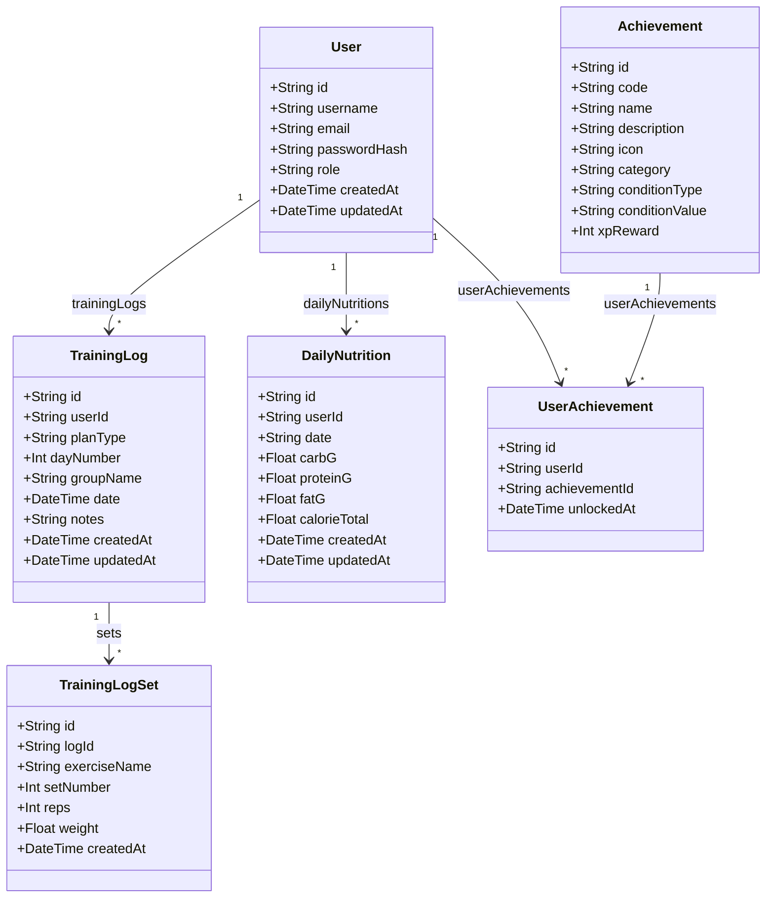
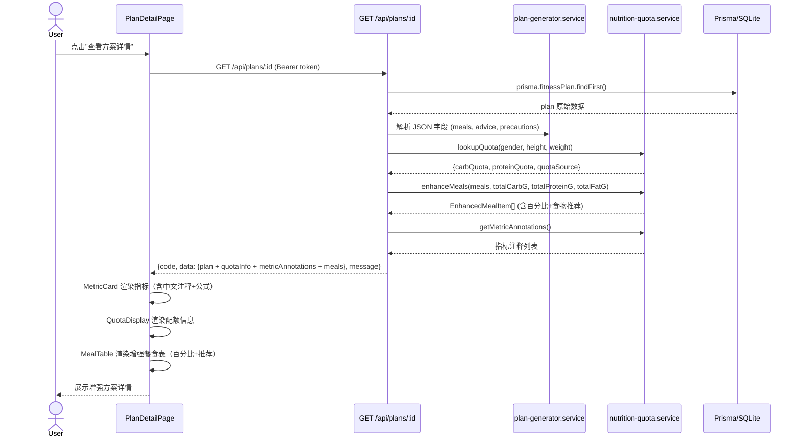
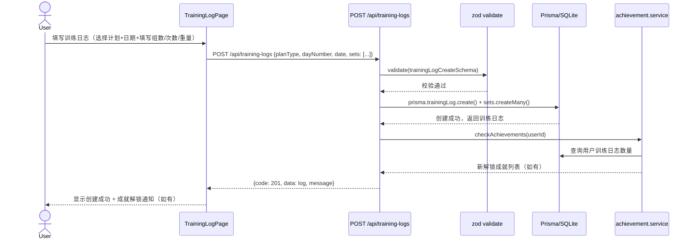
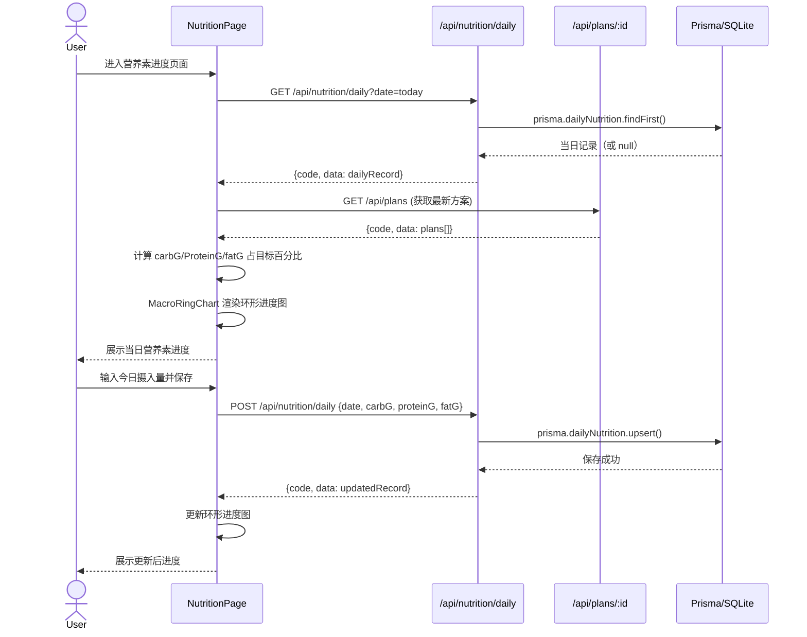
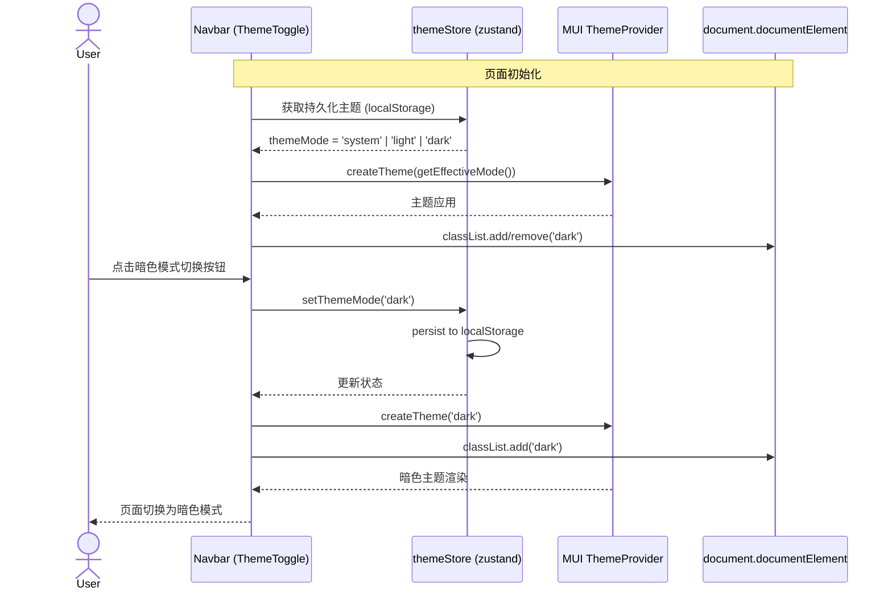
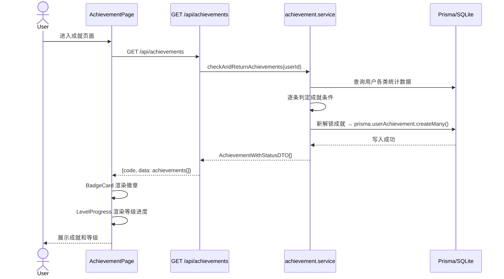
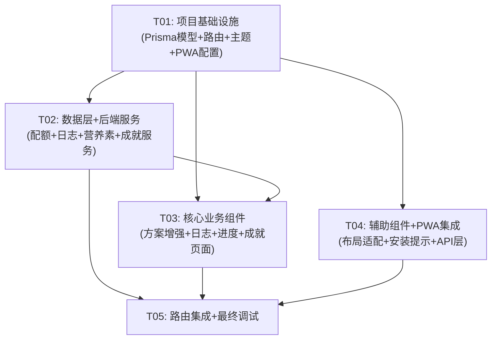

# FitPlan 增量优化 — 系统架构设计文档

## Part A: 系统设计

---

### 1. 实现方案

#### 核心技术挑战

| 优化项 | 挑战点 | 解决思路 |
|--------|--------|----------|
| 方案详情增强 | 配额表查找逻辑（性别×身高分段×体重分段三维映射）；每餐营养素百分比和食物推荐需扩展MealItem结构 | 后端新增 `nutrition-quota.service.ts` 封装配额查找；FitnessPlan 扩展 JSON 字段存储配额结果和每餐推荐 |
| PWA改造 | Service Worker 离线缓存策略（API数据 vs 静态资源）；manifest.json 图标资源 | 使用 Vite PWA 插件（`vite-plugin-pwa`）自动生成 SW 和 manifest；CacheFirst 策略缓存静态资源，NetworkFirst 策略缓存 API |
| 训练日志 | 新增 Prisma 模型（TrainingLog, TrainingLogSet）；CRUD API 与训练计划关联 | 新增模型、路由、服务层；前端新增页面和组件 |
| 宏量营养素进度 | 每日摄入记录模型；环形图/进度条可视化 | 新增 DailyNutrition 模型；使用 recharts（已有依赖）的 PieChart 渲染环形图 |
| 暗色模式 | MUI ThemeProvider 集成（当前无）；Tailwind darkMode 配置；系统偏好跟随；持久化 | 在 main.tsx 包裹 ThemeProvider；Tailwind 开启 `darkMode: 'class'`；zustand store 持久化主题偏好 |
| 成就徽章 | 成就定义和解锁条件判定；用户等级计算；解锁通知 | 后端 Achievement 模型 + UserAchievement 关联；seed 预定义成就；服务层判定解锁 |

#### 框架与库选型

| 选用 | 用途 | 理由 |
|------|------|------|
| `vite-plugin-pwa@^0.20` | PWA（Service Worker + manifest） | Vite 官方推荐 PWA 方案，零配置自动生成 SW，支持 Workbox |
| `recharts@^2.12` | 宏量营养素环形图（已有） | 项目已安装，PieChart + 内层圆实现环形进度 |
| `@mui/material@^5.16` | 暗色模式 ThemeProvider（已有） | 项目已安装，`createTheme` + `ThemeProvider` 即可实现 |
| `zustand@^4.5` | 主题偏好持久化（已有） | 项目已安装，`persist` middleware 存 localStorage |

> **不引入新依赖**：所有优化均基于现有技术栈完成，仅新增 `vite-plugin-pwa` 一个 devDependency。

#### 架构模式

沿用现有架构：
- **前端**：React SPA + Zustand 状态管理 + React Router + MUI + Tailwind CSS
- **后端**：Express REST API + Prisma ORM + SQLite
- **通信**：Axios → `/api/*` → Express Routes → Services → Prisma → SQLite

---

### 2. 文件列表

#### 后端新增/修改文件

```
server/
├── prisma/
│   └── schema.prisma                          # [修改] 新增 TrainingLog, TrainingLogSet, DailyNutrition, Achievement, UserAchievement 模型
├── src/
│   ├── services/
│   │   ├── nutrition-quota.service.ts          # [新增] 性别/身高/体重配额查找 + 每餐百分比 + 食物推荐
│   │   ├── achievement.service.ts              # [新增] 成就判定引擎 + 等级计算
│   │   └── plan-generator.service.ts           # [修改] 集成配额查找，扩展返回结构
│   ├── routes/
│   │   ├── plan.routes.ts                      # [修改] GET /:id 返回配额信息 + 增强数据
│   │   ├── training-log.routes.ts              # [新增] 训练日志 CRUD API
│   │   ├── nutrition.routes.ts                 # [新增] 每日营养素记录 CRUD API
│   │   └── achievement.routes.ts               # [新增] 成就查询 API
│   ├── validators/
│   │   └── index.ts                            # [修改] 新增训练日志、营养素记录的 zod schema
│   └── app.ts                                  # [修改] 注册新路由
```

#### 前端新增/修改文件

```
client/
├── public/
│   ├── manifest.json                           # [新增] PWA manifest
│   ├── icons/                                  # [新增] PWA 图标（192x192, 512x512）
│   │   ├── icon-192.png
│   │   └── icon-512.png
├── src/
│   ├── main.tsx                                # [修改] 包裹 ThemeProvider + 暗色模式初始化
│   ├── App.tsx                                 # [修改] 新增路由（训练日志、营养素进度、成就页面）
│   ├── theme.ts                                # [新增] MUI 亮色/暗色主题配置
│   ├── sw-register.ts                          # [新增] Service Worker 注册逻辑
│   ├── types/
│   │   └── index.ts                            # [修改] 新增 TrainingLog, DailyNutrition, Achievement 等类型
│   ├── stores/
│   │   ├── uiStore.ts                          # [修改] 新增 themeMode 状态
│   │   └── themeStore.ts                       # [新增] 主题偏好持久化 store
│   ├── api/
│   │   ├── training-log.ts                     # [新增] 训练日志 API 调用
│   │   ├── nutrition.ts                        # [新增] 营养素记录 API 调用
│   │   └── achievement.ts                      # [新增] 成就 API 调用
│   ├── components/
│   │   ├── layout/
│   │   │   ├── AppLayout.tsx                   # [修改] 适配暗色模式 bg class
│   │   │   └── Navbar.tsx                      # [修改] 添加暗色模式切换按钮 + PWA安装提示
│   │   ├── plan/
│   │   │   ├── MetricCard.tsx                  # [新增] 核心指标卡片（含中文注释+公式）
│   │   │   ├── MealTable.tsx                   # [新增] 增强餐食表格（百分比+食物推荐）
│   │   │   └── QuotaDisplay.tsx                # [新增] 配额查找结果展示
│   │   ├── nutrition/
│   │   │   └── MacroRingChart.tsx              # [新增] 宏量营养素环形进度图
│   │   ├── achievement/
│   │   │   ├── BadgeCard.tsx                   # [新增] 成就徽章卡片
│   │   │   └── LevelProgress.tsx               # [新增] 等级进度条
│   │   ├── training-log/
│   │   │   └── LogForm.tsx                     # [新增] 训练日志录入表单
│   │   └── pwa/
│   │       └── InstallPrompt.tsx               # [新增] PWA 安装提示组件
│   ├── pages/
│   │   ├── PlanDetailPage.tsx                  # [修改] 使用增强组件重构
│   │   ├── TrainingLogPage.tsx                 # [新增] 训练日志页面
│   │   ├── NutritionPage.tsx                   # [新增] 营养素进度页面
│   │   └── AchievementPage.tsx                 # [新增] 成就徽章页面
│   └── styles/
│       └── globals.css                         # [修改] 新增暗色模式 CSS 变量
├── index.html                                  # [修改] 添加 manifest link + theme-color meta
├── vite.config.ts                              # [修改] 添加 VitePWA 插件配置
├── tailwind.config.js                          # [修改] 开启 darkMode: 'class'
└── package.json                                # [修改] 新增 vite-plugin-pwa devDependency
```

---

### 3. 数据结构与接口

#### 3.1 新增 Prisma 模型



#### 3.2 扩展的 API 接口

**训练日志 API** (`/api/training-logs`)

| 方法 | 路径 | 说明 | 请求体 | 响应 |
|------|------|------|--------|------|
| GET | `/api/training-logs` | 获取用户训练日志列表（支持 ?date= 按日期过滤） | — | `{ code, data: TrainingLogDTO[], message }` |
| GET | `/api/training-logs/:id` | 获取单条训练日志详情（含 sets） | — | `{ code, data: TrainingLogDetailDTO, message }` |
| POST | `/api/training-logs` | 创建训练日志 | `{ planType, dayNumber, groupName, date, notes, sets: [{exerciseName, setNumber, reps, weight}] }` | `{ code: 201, data: TrainingLogDetailDTO, message }` |
| PUT | `/api/training-logs/:id` | 更新训练日志 | `{ notes?, sets?: [...] }` | `{ code, data: TrainingLogDetailDTO, message }` |
| DELETE | `/api/training-logs/:id` | 删除训练日志 | — | `{ code, data: null, message }` |

**营养素记录 API** (`/api/nutrition`)

| 方法 | 路径 | 说明 | 请求体 | 响应 |
|------|------|------|--------|------|
| GET | `/api/nutrition/daily` | 获取当日营养素记录 | — | `{ code, data: DailyNutritionDTO, message }` |
| GET | `/api/nutrition/daily?date=YYYY-MM-DD` | 获取指定日期营养素记录 | — | `{ code, data: DailyNutritionDTO, message }` |
| POST | `/api/nutrition/daily` | 创建/更新当日营养素 | `{ date, carbG, proteinG, fatG }` | `{ code, data: DailyNutritionDTO, message }` |
| GET | `/api/nutrition/plan-target/:planId` | 获取方案的目标营养素（用于对比） | — | `{ code, data: {carbG, proteinG, fatG, calorieTarget}, message }` |

**成就 API** (`/api/achievements`)

| 方法 | 路径 | 说明 | 请求体 | 响应 |
|------|------|------|--------|------|
| GET | `/api/achievements` | 获取所有成就定义 + 用户解锁状态 | — | `{ code, data: AchievementWithStatusDTO[], message }` |
| GET | `/api/achievements/my-level` | 获取用户等级信息 | — | `{ code, data: UserLevelDTO, message }` |
| POST | `/api/achievements/check` | 手动触发成就检查 | — | `{ code, data: newlyUnlocked: string[], message }` |

**方案详情增强** (修改现有 `GET /api/plans/:id`)

响应 `data` 新增字段：
```typescript
{
  // ... 原有字段
  quotaInfo: {
    carbQuota: number;        // 碳水 g/kg 配额
    proteinQuota: number;     // 蛋白质 g/kg 配额
    quotaSource: string;      // 配额来源说明（如"男性 身高170cm 体重71-80kg段"）
  };
  metricAnnotations: Array<{
    key: string;              // 指标英文 key（如 "bmi"）
    label: string;            // 中文名称（如"身体质量指数"）
    formula: string;          // 计算公式（如"体重(kg) / 身高(m)²"）
    description: string;      // 简要说明
  }>;
  meals: {
    trainingDay: EnhancedMealItem[];
    restDay: EnhancedMealItem[];
  };
}

interface EnhancedMealItem extends MealItem {
  carbPercent: number;        // 碳水占全天比例%
  proteinPercent: number;     // 蛋白质占全天比例%
  fatPercent: number;         // 脂肪占全天比例%
  caloriePercent: number;     // 热量占全天比例%
  foodSuggestions: FoodSuggestion[];
}

interface FoodSuggestion {
  name: string;               // 推荐食物名称
  amount: string;             // 建议摄入量（如"200g"）
  category: string;           // CARB | PROTEIN | FAT
  reason: string;             // 推荐理由
}
```

#### 3.3 新增前端类型定义

```typescript
// 训练日志
interface TrainingLogDTO {
  id: string;
  userId: string;
  planType: string;
  dayNumber: number;
  groupName: string;
  date: string;
  notes: string;
  sets: TrainingLogSetDTO[];
  createdAt: string;
  updatedAt: string;
}

interface TrainingLogSetDTO {
  id: string;
  logId: string;
  exerciseName: string;
  setNumber: number;
  reps: number;
  weight: number;
}

// 每日营养素
interface DailyNutritionDTO {
  id: string;
  userId: string;
  date: string;
  carbG: number;
  proteinG: number;
  fatG: number;
  calorieTotal: number;
  createdAt: string;
  updatedAt: string;
}

// 成就
interface AchievementDTO {
  id: string;
  code: string;
  name: string;
  description: string;
  icon: string;
  category: string;
  conditionType: string;
  conditionValue: string;
  xpReward: number;
  unlocked: boolean;
  unlockedAt: string | null;
}

interface UserLevelDTO {
  level: number;
  currentXp: number;
  nextLevelXp: number;
  totalXp: number;
  title: string;
}

// 主题
type ThemeMode = 'light' | 'dark' | 'system';
```

---

### 4. 程序调用流程

#### 4.1 方案详情增强 — 查看健身方案



#### 4.2 训练日志 — 创建训练日志



#### 4.3 宏量营养素进度 — 记录并查看



#### 4.4 暗色模式 — 切换主题



#### 4.5 成就系统 — 成就检查与解锁



---

### 5. 待明确事项

| 编号 | 问题 | 当前假设 |
|------|------|----------|
| Q1 | 配额表中身高/体重边界值如何处理（如恰好160cm、恰好60kg）？ | 采用闭区间，≤含等号，如"≤60kg"包含60kg |
| Q2 | 食物推荐的数据来源？是硬编码还是从现有 Food 表关联？ | 从现有 Food 表按 category 筛选匹配，按 nutritionRate 和 giIndex 排序推荐前3个 |
| Q3 | 成就解锁通知用 Snackbar 还是 Push Notification？ | 使用现有 Snackbar（useUIStore.showSnackbar），不引入 Push Notification |
| Q4 | PWA 图标资源从何获取？ | 需要设计/提供 192x192 和 512x512 的 PNG 图标，先用占位图 |
| Q5 | 用户等级的 XP 阈值和等级称号？ | 每级需 100 XP，等级称号：1级新手→5级铁人，具体在 seed 中定义 |
| Q6 | DailyNutrition 的 calorieTotal 是前端传还是后端算？ | 后端根据 carbG×4 + proteinG×4 + fatG×9 自动计算 |
| Q7 | 训练日志的 planType/dayNumber 是用户手动选还是从训练计划自动关联？ | 用户从训练计划列表中选择，自动填充 planType 和 dayNumber |

---

## Part B: 任务分解

---

### 6. 依赖包列表

```
# 前端 devDependencies
- vite-plugin-pwa@^0.20.0: Vite PWA 插件，自动生成 Service Worker 和 manifest.json

# 后端（无新增依赖）

# 前端已有依赖（无需安装）
- @mui/material@^5.16.0: 暗色模式 ThemeProvider
- recharts@^2.12.0: 环形进度图
- zustand@^4.5.4: 主题偏好持久化
```

---

### 7. 任务列表

#### T01: 项目基础设施 — Prisma模型 + 路由注册 + 主题系统 + PWA配置

**源文件：**
- `server/prisma/schema.prisma` — 新增 TrainingLog, TrainingLogSet, DailyNutrition, Achievement, UserAchievement 模型
- `server/src/app.ts` — 注册 training-log, nutrition, achievement 路由
- `server/src/validators/index.ts` — 新增训练日志、营养素记录的 zod schema
- `client/src/theme.ts` — MUI 亮色/暗色主题配置
- `client/src/stores/themeStore.ts` — 主题偏好 zustand store（持久化）
- `client/src/main.tsx` — 包裹 ThemeProvider + 暗色模式初始化
- `client/src/stores/uiStore.ts` — 新增 themeMode 状态
- `client/vite.config.ts` — 添加 VitePWA 插件配置
- `client/tailwind.config.js` — 开启 darkMode: 'class'
- `client/index.html` — 添加 manifest link + theme-color meta
- `client/package.json` — 新增 vite-plugin-pwa
- `client/src/styles/globals.css` — 新增暗色模式 CSS 变量

**依赖：** 无

**优先级：** P0

---

#### T02: 数据层 + 后端服务 — 配额服务 + 训练日志服务 + 营养素服务 + 成就服务

**源文件：**
- `server/src/services/nutrition-quota.service.ts` — 性别/身高/体重配额查找 + 每餐百分比计算 + 食物推荐
- `server/src/services/achievement.service.ts` — 成就判定引擎 + 等级计算
- `server/src/services/plan-generator.service.ts` — 集成配额查找，扩展返回结构
- `server/src/routes/training-log.routes.ts` — 训练日志 CRUD API
- `server/src/routes/nutrition.routes.ts` — 每日营养素记录 CRUD API
- `server/src/routes/achievement.routes.ts` — 成就查询 API
- `server/src/routes/plan.routes.ts` — 修改 GET /:id 返回配额信息 + 增强数据
- `server/prisma/seed.ts` — 新增 Achievement 种子数据

**依赖：** T01

**优先级：** P0

---

#### T03: 核心业务组件 — 方案详情增强 + 训练日志 + 营养素进度 + 成就页面

**源文件：**
- `client/src/components/plan/MetricCard.tsx` — 核心指标卡片（含中文注释+公式）
- `client/src/components/plan/MealTable.tsx` — 增强餐食表格（百分比+食物推荐）
- `client/src/components/plan/QuotaDisplay.tsx` — 配额查找结果展示
- `client/src/components/nutrition/MacroRingChart.tsx` — 宏量营养素环形进度图
- `client/src/components/achievement/BadgeCard.tsx` — 成就徽章卡片
- `client/src/components/achievement/LevelProgress.tsx` — 等级进度条
- `client/src/components/training-log/LogForm.tsx` — 训练日志录入表单
- `client/src/pages/PlanDetailPage.tsx` — 使用增强组件重构
- `client/src/pages/TrainingLogPage.tsx` — 训练日志页面
- `client/src/pages/NutritionPage.tsx` — 营养素进度页面
- `client/src/pages/AchievementPage.tsx` — 成就徽章页面

**依赖：** T01, T02

**优先级：** P0

---

#### T04: 辅助组件 + PWA集成 — 布局适配 + 安装提示 + Service Worker注册 + API层

**源文件：**
- `client/src/components/layout/AppLayout.tsx` — 适配暗色模式 bg class
- `client/src/components/layout/Navbar.tsx` — 添加暗色模式切换按钮 + PWA安装入口
- `client/src/components/pwa/InstallPrompt.tsx` — PWA 安装提示组件（beforeinstallprompt）
- `client/src/sw-register.ts` — Service Worker 注册逻辑
- `client/src/api/training-log.ts` — 训练日志 API 调用
- `client/src/api/nutrition.ts` — 营养素记录 API 调用
- `client/src/api/achievement.ts` — 成就 API 调用
- `client/src/types/index.ts` — 新增所有新类型定义
- `client/public/icons/icon-192.png` — PWA 图标（占位）
- `client/public/icons/icon-512.png` — PWA 图标（占位）

**依赖：** T01

**优先级：** P1

---

#### T05: 路由集成 + 最终调试 — 路由配置 + 组件集成 + 端到端验证

**源文件：**
- `client/src/App.tsx` — 新增路由（训练日志、营养素进度、成就页面）
- `client/src/components/layout/Navbar.tsx` — 导航菜单添加新页面入口（如有遗漏）
- 所有页面集成验证

**依赖：** T01, T02, T03, T04

**优先级：** P1

---

### 8. 共享知识

```
- 所有 API 响应统一使用 {code, data, message} 格式
- 认证使用 JWT Bearer Token，前端 localStorage 存储 key 为 'fitplan_token'
- Prisma JSON 字段存储为 String，读取时需 JSON.parse()，写入时需 JSON.stringify()
- 所有日期字段存储为 ISO 8601 字符串（YYYY-MM-DD 或 ISO DateTime）
- 前端 MUI 主题色：primary=#3B82F6, secondary=#10B981, accent=#F59E0B
- Tailwind darkMode 使用 'class' 策略，暗色模式通过 document.documentElement.classList.add('dark') 切换
- 新增 API 路由需在 server/src/app.ts 中注册
- 新增前端路由需在 client/src/App.tsx 中配置
- Prisma 模型修改后需执行 npx prisma db push 同步数据库
- Node.js v25 注意：import JSON 使用 with { type: 'json' } 而非 assert { type: 'json' }
- 不要自动提交推送到远程仓库
- 前端 API 调用统一通过 client/src/api/client.ts 的 axios 实例
- Zustand store 持久化使用 persist middleware，存储到 localStorage
- 成就判定在后端执行，前端仅展示
- PWA 缓存策略：静态资源 CacheFirst，API 请求 NetworkFirst
```

---

### 9. 任务依赖图


