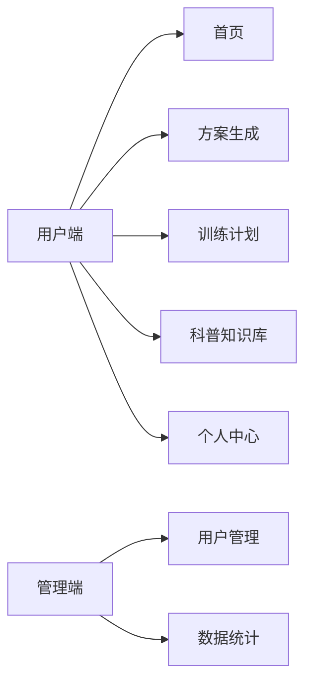
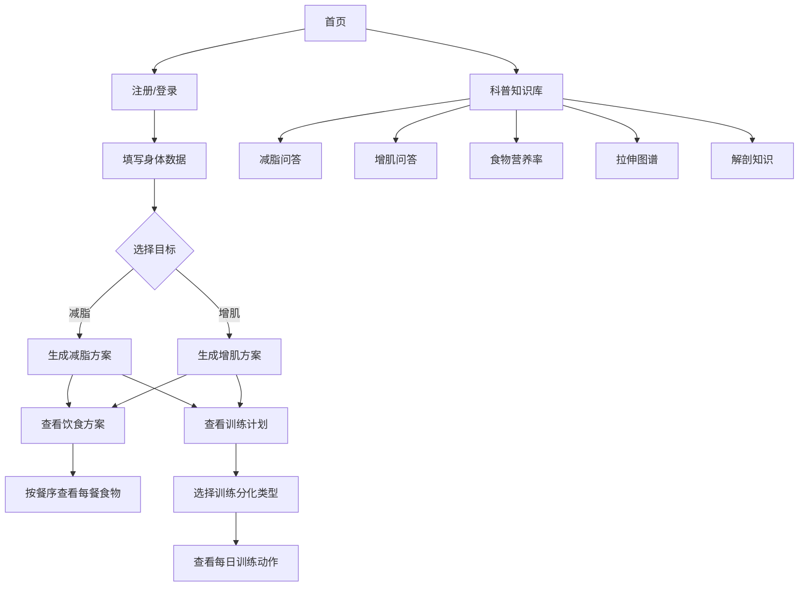
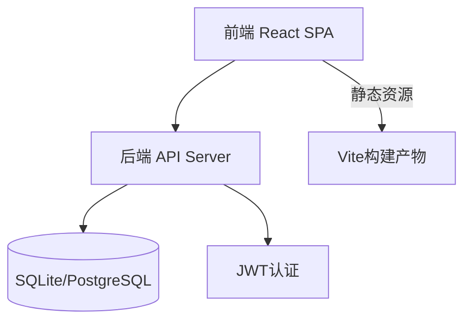

# FitPlan 健身方案制定系统 - 需求方案文档

> **版本**: v2.0  
> **日期**: 2026-05-24  
> **状态**: 待决策  
> **数据源**: 好人松松《健身Excel超级套表》29个Sheet

---

## 一、产品定位与决策建议

### 1.1 产品形态建议：响应式 Web 应用

| 维度 | 分析 |
|------|------|
| **小程序** | 优点：触达方便、分享裂变快；缺点：审核周期长、包体积限制（2MB）、无法做复杂表格渲染、每次更新需审核 |
| **App** | 优点：功能最全、可离线；缺点：开发成本高（需双端）、分发难、用户下载门槛高 |
| **Web 应用** ✅ | 优点：跨平台、即时更新、无审核、复杂表格渲染友好、开发效率最高；缺点：离线能力弱（可用PWA弥补） |

**结论：先做响应式 Web 应用，后期可套壳为 PWA 或用 Taro 转小程序。**

### 1.2 产品一句话描述

> 输入你的身体数据，自动生成个性化的增肌/减脂饮食方案 + 训练计划，把好人松松的 Excel 套表搬到线上。

### 1.3 目标用户

- 有增肌/减脂需求的健身爱好者（尤其是新手）
- 不懂营养学但想科学饮食的人
- 不想用 Excel 手动计算的懒人
- 目前用薄荷等 app 但觉得不精准的人

### 1.4 核心差异化

不同于薄荷健康等「记录型」工具，本产品是**方案生成型**：
- 薄荷 = 你吃了什么 → 记录下来
- 本产品 = 你想达到什么目标 → 帮你算出来该吃多少、练什么

---

## 二、功能模块总览

基于数据源的 29 个 Sheet，梳理为以下 5 大功能模块：



| 模块 | 对应数据源 | 优先级 |
|------|-----------|--------|
| 🏠 首页 | - | P0 |
| 📋 方案生成（核心） | Sheet 1-16（减脂×8 + 增肌×7 + 有氧×1） | P0 |
| 🏋️ 训练计划 | Sheet 20-24（三分化/四分化/居家/力量预测） | P0 |
| 📚 科普知识库 | Sheet 17-19（问答×2 + 食物营养率） + Sheet 25-29（拉伸/解剖） | P1 |
| 👤 用户系统 | 注册/登录/个人信息 | P0 |
| 🛡️ 管理后台 | 用户管理/数据统计 | P1 |

---

## 三、核心功能详细设计

### 3.1 方案生成模块（P0 - 最核心）

这是整个产品的灵魂。用户输入身体数据 → 系统自动计算 → 输出完整的饮食方案。

#### 3.1.1 用户输入项

| 输入项 | 说明 | 数据源依据 |
|--------|------|-----------|
| 性别 | 男/女 | 所有方案Sheet |
| 身高 | cm | 所有方案Sheet |
| 体重 | kg | 所有方案Sheet |
| 年龄 | 岁 | 基础代谢计算需要 |
| 目标 | 增肌/减脂 | 方案分为增肌和减脂两大类 |
| 力训时间 | 早饭后练(早起/晚起)/午饭前/午饭后/晚饭前/晚饭后/夜里练/无力训 | 7个时段×增肌减脂 = 14种方案 |
| 训练水平 | 新手/有基础/老手 | 力训消耗数据需要 |
| 是否有氧 | 是/否 + 有氧类型/时长/心率 | Sheet 16 有氧热量消耗 |
| 体脂率（可选） | % | 用于更精准的方案调整 |

#### 3.1.2 系统自动计算项

系统基于 Mifflin-St Jeor 方程和好人松松的计算逻辑，自动完成以下计算：

| 计算项 | 公式 | 备注 |
|--------|------|------|
| BMI | 体重kg ÷ 身高m ÷ 身高m | 正常18.5-24 超重24-28 肥胖>28 |
| 基础代谢(BMR) | 男: 体重×9.99+身高×6.25-年龄×4.92+5<br>女: 体重×9.99+身高×6.25-年龄×4.92-161 | Mifflin-St Jeor方程 |
| 无运动总消耗 | BMR ÷ 0.7 | 基础代谢约占70% |
| 力训消耗 | 男: 150/200/250大卡(新手/有基础/老手)<br>女: 100/150/200大卡 | 固定参考值 |
| 有氧消耗 | (运动心率÷静息心率×6.4-6.2) × 体重 × 时长 ÷ 7 | Sheet 16 |
| 力训日平衡热量 | 无运动总消耗 + 力训消耗 + 有氧消耗 | - |
| 休息日平衡热量 | 无运动总消耗 + 有氧消耗 | - |
| **减脂应吃热量** | 平衡热量 × 0.64 | 含20%热量缺口+20%余地 |
| **增肌应吃热量** | 平衡热量 × 0.84 | 含5%热量盈余+11%余地 |
| 碳水配额 | 根据目标体重×配额系数 | 增肌减脂配额不同 |
| 蛋白质配额 | 根据目标体重×配额系数 | 增肌减脂配额不同 |
| 脂肪配额 | 男60g/女50g(120kg+则70g) | 固定参考值 |

#### 3.1.3 方案输出

根据用户的 **目标（增肌/减脂）× 力训时间** 组合，从 14 种方案中选择对应的一种，输出：

**饮食方案**：
- 力训日：按餐序（练前餐 → 练后餐 → 其他餐）给出每餐的碳水/蛋白质/脂肪摄入量
- 休息日：按餐序给出摄入量
- 每餐给出食物选择建议（如：鸡蛋+牛奶、鸡胸肉+米饭等）
- 每种食物给出具体克数

**运动建议**：
- 力训：训练频率、时长建议
- 有氧：是否需要、推荐类型、心率范围、时长

**注意事项**：
- 减重/增重速度预期
- 何时该转增肌/减脂
- 配额调整提示（体重变化10kg后）

#### 3.1.4 关键业务规则

| 规则 | 说明 |
|------|------|
| 减脂建议 | 男性BMI 22-23转增肌，女性BMI 20-21转增肌；有向心肥胖则多减 |
| 增肌建议 | 男性BMI 23-24转减脂，女性BMI 21-22转减脂 |
| 有氧是否需要 | 增肌不做有氧；减脂80kg+不做有氧；减脂70kg以下可选做有氧 |
| 体重调整 | 体重变化10kg需调整配额（约150大卡） |
| 减重速度 | 理论上2周减重2% |
| 增重速度 | 男性每月1kg，女性每月0.5kg |

---

### 3.2 训练计划模块（P0）

#### 3.2.1 训练计划类型

| 类型 | 对应Sheet | 适用人群 |
|------|-----------|---------|
| 健身房三分化 | Sheet 20 | 新手首选，推拉腿 |
| 健身房四分化（肩单练版） | Sheet 21 | 有基础，想重点练肩 |
| 健身房四分化（手臂单练版） | Sheet 22 | 有基础，想重点练手臂 |
| 居家三分化 | Sheet 23 | 无法去健身房 |

#### 3.2.2 训练计划内容

每个训练计划包含：
- **训练频率**：每周3-5次
- **训练分化**：每个Day练哪些部位
- **动作列表**：部位 → 组数 → 可选动作（每个动作含关节活动说明）
- **配重建议**：8-12次力竭的配重
- **组间休息**：多关节2-3分钟，单关节1-1.5分钟
- **女性特殊建议**：减半练胸频率、少练股四

#### 3.2.3 力量预测计算器（附加功能）

基于 Sheet 24，用户输入配重+力竭次数，输出9种公式的最大力量预测值：
- Adams / Brown / Brzycki / Lander / Lombardi / Mayhew / O'Connor / Wathen / Welday

---

### 3.3 科普知识库模块（P1）

#### 3.3.1 问答库

| 分类 | 问题数 | 来源 |
|------|--------|------|
| 减脂问答 | 26个 | Sheet 17 |
| 增肌问答 | 18个 | Sheet 18 |

问答支持搜索、按分类浏览、关键词匹配。

#### 3.3.2 食物营养率数据库

来源于 Sheet 19，包含：

| 分类 | 内容 |
|------|------|
| 碳水食物 | 米类主食、麦类主食、其他主食、方便食品、便携碳水 |
| 蛋白质食物 | 瘦肉、蛋奶、蛋白粉等 |
| 脂肪食物 | 油脂、坚果等 |

每条记录包含：食物名称、营养率（碳水率/蛋白质率/脂肪率）、GI指数、食用建议。

#### 3.3.3 拉伸与解剖

| 内容 | 来源 |
|------|------|
| 上身肌肉拉伸 | Sheet 25 |
| 下身肌肉拉伸 | Sheet 26 |
| 健身解剖总结（文字版） | Sheet 27 |
| 关节活动的肌肉（图示版） | Sheet 28 |
| 肌肉的关节活动（图示版） | Sheet 29 |

---

### 3.4 用户系统（P0）

#### 3.4.1 用户角色

| 角色 | 注册方式 | 权限 |
|------|----------|------|
| 普通用户 | 邮箱/手机号注册 | 填写身体数据、生成方案、查看科普、管理个人方案 |
| 管理员 | 后台创建 | 查看用户列表、管理用户、查看统计数据 |

#### 3.4.2 用户数据模型

**基本信息**：邮箱/手机号、密码、昵称、头像

**身体数据**（方案生成所需）：
- 性别、身高、体重、年龄
- 体脂率（可选）
- 训练水平（新手/有基础/老手）
- 力训时间偏好
- 有氧习惯（类型、时长、心率）
- 目标（增肌/减脂）+ 目标体重

---

### 3.5 管理后台（P1）

| 功能 | 描述 |
|------|------|
| 用户列表 | 查看所有注册用户，支持搜索、筛选 |
| 用户详情 | 查看用户身体数据、生成的方案 |
| 数据统计 | 用户增长趋势、方案生成次数、增肌vs减脂占比 |
| 科普管理 | 增删改查科普文章/问答 |

---

## 四、页面设计

### 4.1 页面清单

| 页面 | 路由 | 说明 |
|------|------|------|
| 首页 | `/` | 产品介绍、功能导航、快速入口 |
| 登录 | `/login` | 邮箱/手机号 + 密码 |
| 注册 | `/register` | 基本信息注册 |
| 方案生成 | `/plan/create` | 填写身体数据，生成方案 |
| 方案详情 | `/plan/:id` | 查看生成的方案（饮食+训练） |
| 方案历史 | `/plan/history` | 历史生成的方案列表 |
| 训练计划 | `/training` | 选择训练计划类型，查看计划详情 |
| 力量预测 | `/training/strength` | 输入配重+次数，预测最大力量 |
| 科普首页 | `/knowledge` | 科普分类导航 |
| 食物营养率 | `/knowledge/food` | 食物营养率查询 |
| 减脂问答 | `/knowledge/qa-fat-loss` | 减脂常见问题 |
| 增肌问答 | `/knowledge/qa-muscle` | 增肌常见问题 |
| 拉伸图谱 | `/knowledge/stretch` | 上下身拉伸指导 |
| 解剖知识 | `/knowledge/anatomy` | 健身解剖学 |
| 个人中心 | `/profile` | 个人信息、身体数据、目标设置 |
| 管理后台 | `/admin` | 用户管理、数据统计 |

### 4.2 核心页面流程



### 4.3 设计风格

| 维度 | 规格 |
|------|------|
| **主色调** | 活力蓝 #3B82F6 + 健康绿 #10B981 |
| **强调色** | 橙色 #F59E0B（CTA按钮、重要数据） |
| **布局** | 卡片式，留白充足，信息层级分明 |
| **字体** | Inter / system-ui 无衬线字体 |
| **图标** | 线性图标，简洁现代 |
| **动画** | 数据数字平滑计数、页面过渡、方案生成加载动画 |
| **响应式** | 桌面优先，移动端适配 |

---

## 五、技术架构

### 5.1 整体架构



### 5.2 技术选型

| 层 | 技术 | 理由 |
|----|------|------|
| **前端框架** | React 18 + TypeScript | 生态成熟，类型安全 |
| **构建工具** | Vite 5 | 快速开发、HMR |
| **样式方案** | TailwindCSS 3 + MUI | 原子化CSS + 组件库 |
| **路由** | React Router 6 | 声明式路由 |
| **HTTP客户端** | Axios | 拦截器、取消请求 |
| **状态管理** | React Context + Hooks | 项目规模不需要Redux |
| **后端框架** | Node.js + Express 4 | 轻量、灵活 |
| **数据库** | SQLite（开发）→ PostgreSQL（生产） | 零配置起步 |
| **ORM** | Prisma | 类型安全、迁移方便 |
| **认证** | JWT + bcrypt | 无状态认证 |
| **数据可视化** | Recharts | 图表组件 |

### 5.3 前端路由设计

| 路由 | 页面 | 权限 |
|------|------|------|
| `/` | 首页 | 公开 |
| `/login` | 登录 | 公开 |
| `/register` | 注册 | 公开 |
| `/plan/create` | 方案生成 | 需登录 |
| `/plan/:id` | 方案详情 | 需登录 |
| `/plan/history` | 方案历史 | 需登录 |
| `/training` | 训练计划 | 需登录 |
| `/training/strength` | 力量预测 | 需登录 |
| `/knowledge` | 科普首页 | 公开 |
| `/knowledge/food` | 食物营养率 | 公开 |
| `/knowledge/qa-fat-loss` | 减脂问答 | 公开 |
| `/knowledge/qa-muscle` | 增肌问答 | 公开 |
| `/knowledge/stretch` | 拉伸图谱 | 公开 |
| `/knowledge/anatomy` | 解剖知识 | 公开 |
| `/profile` | 个人中心 | 需登录 |
| `/admin` | 管理后台 | 管理员 |

### 5.4 后端API设计

#### 认证相关
| 路由 | 方法 | 说明 |
|------|------|------|
| `/api/auth/register` | POST | 用户注册 |
| `/api/auth/login` | POST | 用户登录 |
| `/api/auth/me` | GET | 获取当前用户信息 |

#### 用户数据
| 路由 | 方法 | 说明 |
|------|------|------|
| `/api/users/profile` | GET | 获取用户资料+身体数据 |
| `/api/users/profile` | PUT | 更新用户资料+身体数据 |
| `/api/users/body-data` | PUT | 更新身体数据（独立接口） |

#### 方案
| 路由 | 方法 | 说明 |
|------|------|------|
| `/api/plans/generate` | POST | 生成健身方案（传入身体数据） |
| `/api/plans` | GET | 获取方案列表 |
| `/api/plans/:id` | GET | 获取方案详情 |
| `/api/plans/:id` | DELETE | 删除方案 |

#### 科普内容
| 路由 | 方法 | 说明 |
|------|------|------|
| `/api/knowledge/foods` | GET | 获取食物营养率列表（支持搜索/分类筛选） |
| `/api/knowledge/qa` | GET | 获取问答列表（支持按类型/关键词筛选） |
| `/api/knowledge/stretch` | GET | 获取拉伸图谱 |
| `/api/knowledge/anatomy` | GET | 获取解剖知识 |

#### 训练计划
| 路由 | 方法 | 说明 |
|------|------|------|
| `/api/training/plans` | GET | 获取训练计划列表 |
| `/api/training/plans/:type` | GET | 获取指定类型训练计划详情 |
| `/api/training/strength-predict` | POST | 力量预测计算 |

#### 管理后台
| 路由 | 方法 | 说明 |
|------|------|------|
| `/api/admin/users` | GET | 获取用户列表 |
| `/api/admin/users/:id` | GET | 获取用户详情 |
| `/api/admin/stats` | GET | 获取统计数据 |

### 5.5 数据模型

#### users 用户表
| 字段 | 类型 | 说明 |
|------|------|------|
| id | UUID | 主键 |
| email | VARCHAR | 邮箱（唯一） |
| phone | VARCHAR | 手机号（唯一，可选） |
| password_hash | VARCHAR | 密码哈希 |
| nickname | VARCHAR | 昵称 |
| avatar | VARCHAR | 头像URL |
| role | ENUM | user / admin |
| created_at | TIMESTAMP | 创建时间 |
| updated_at | TIMESTAMP | 更新时间 |

#### user_body_data 身体数据表
| 字段 | 类型 | 说明 |
|------|------|------|
| id | UUID | 主键 |
| user_id | UUID | 用户ID（外键） |
| gender | ENUM | male / female |
| height | DECIMAL | 身高(cm) |
| weight | DECIMAL | 体重(kg) |
| age | INT | 年龄 |
| body_fat | DECIMAL | 体脂率(%)，可选 |
| training_level | ENUM | beginner / intermediate / advanced |
| training_time | ENUM | 力训时段(7种) |
| goal | ENUM | muscle_gain / fat_loss |
| has_cardio | BOOLEAN | 是否有氧 |
| cardio_type | VARCHAR | 有氧类型 |
| cardio_duration | DECIMAL | 有氧时长(小时/周) |
| exercise_heart_rate | INT | 运动心率 |
| resting_heart_rate | INT | 静息心率 |
| target_weight | DECIMAL | 目标体重 |
| updated_at | TIMESTAMP | 更新时间 |

#### fitness_plans 健身方案表
| 字段 | 类型 | 说明 |
|------|------|------|
| id | UUID | 主键 |
| user_id | UUID | 用户ID（外键） |
| goal | ENUM | muscle_gain / fat_loss |
| plan_type | VARCHAR | 方案类型（如"减脂-早饭后练(早起版)"） |
| plan_data | JSONB | 完整方案数据（热量/碳水/蛋白质/脂肪/每餐食物） |
| bmi | DECIMAL | 生成时的BMI |
| bmr | DECIMAL | 生成时的基础代谢 |
| tdee_training | DECIMAL | 力训日TDEE |
| tdee_rest | DECIMAL | 休息日TDEE |
| created_at | TIMESTAMP | 创建时间 |

#### foods 食物营养率表
| 字段 | 类型 | 说明 |
|------|------|------|
| id | UUID | 主键 |
| name | VARCHAR | 食物名称 |
| category | VARCHAR | 大类（米类主食/麦类主食/蛋白质等） |
| sub_category | VARCHAR | 子类 |
| carb_rate | DECIMAL | 碳水率 |
| protein_rate | DECIMAL | 蛋白质率 |
| fat_rate | DECIMAL | 脂肪率 |
| gi_index | VARCHAR | GI指数（高/中/低） |
| notes | TEXT | 食用建议 |

#### qa_articles 问答文章表
| 字段 | 类型 | 说明 |
|------|------|------|
| id | UUID | 主键 |
| type | ENUM | fat_loss / muscle_gain |
| question | VARCHAR | 问题 |
| answer | TEXT | 回答 |
| sort_order | INT | 排序 |

#### training_plans 训练计划表
| 字段 | 类型 | 说明 |
|------|------|------|
| id | UUID | 主键 |
| type | VARCHAR | 计划类型 |
| name | VARCHAR | 计划名称 |
| description | TEXT | 说明 |
| plan_data | JSONB | 计划详情（每日动作列表） |

---

## 六、核心算法逻辑

### 6.1 方案生成算法

```
输入：性别、身高、体重、年龄、目标、力训时间、训练水平、有氧数据

1. 计算 BMI = 体重 / (身高/100)²
2. 计算 BMR (Mifflin-St Jeor)
   - 男：体重×9.99 + 身高×6.25 - 年龄×4.92 + 5
   - 女：体重×9.99 + 身高×6.25 - 年龄×4.92 - 161
3. 计算无运动总消耗 = BMR / 0.7
4. 计算力训消耗（按训练水平）
5. 计算有氧消耗（如适用）
6. 计算力训日/休息日平衡热量
7. 计算应吃热量
   - 减脂：平衡热量 × 0.64
   - 增肌：平衡热量 × 0.84
8. 计算宏量营养素分配
   - 蛋白质：体重 × 配额系数（g/kg）
   - 脂肪：男60g/女50g（120kg+则70g）
   - 碳水：剩余热量 ÷ 4
9. 根据 目标×力训时间 选择对应方案模板
10. 填充每餐食物推荐
11. 输出完整方案
```

### 6.2 力量预测算法

```
输入：配重(kg)、力竭次数

输出：9种公式的1RM预测值
- Adams:     配重 / (1 - 0.02 × 次数)
- Brown:     (次数 × 0.0328 + 0.9849) × 配重
- Brzycki:   配重 / (1.0278 - 0.0278 × 次数)
- Lander:    配重 / (1.013 - 0.0267123 × 次数)
- Lombardi:  次数^0.1 × 配重
- Mayhew:    配重 / (0.522 + 0.419 × e^(-0.055 × 次数))
- O'Connor:  0.025 × (配重 × 次数) + 配重
- Wathen:    配重 / (0.488 + 0.538 × e^(-0.075 × 次数))
- Welday:    (次数 × 0.0333) × 配重 + 配重
```

---

## 七、开发计划

### Phase 1：基础框架 + 用户系统（1周）
- [x] 前后端项目初始化
- [ ] 数据库设计与 Prisma Schema
- [ ] 用户注册/登录（JWT认证）
- [ ] 基本页面框架（导航栏、路由）

### Phase 2：核心方案生成（1.5周）
- [ ] 身体数据填写页面
- [ ] 方案生成算法实现
- [ ] 14种饮食方案模板数据化
- [ ] 方案展示页面（饮食+运动建议）
- [ ] 方案历史记录

### Phase 3：训练计划 + 知识库（1周）
- [ ] 4种训练计划页面
- [ ] 力量预测计算器
- [ ] 食物营养率数据库导入
- [ ] 减脂/增肌问答页面
- [ ] 拉伸图谱 + 解剖知识页面

### Phase 4：管理后台 + 优化（0.5周）
- [ ] 管理员用户管理
- [ ] 数据统计图表
- [ ] 整体样式优化
- [ ] 响应式适配

---

## 八、待确认事项

> 以下问题需要你决策后再进入开发：

| # | 问题 | 选项 | 建议 |
|---|------|------|------|
| 1 | **数据源使用方式** | A. 把Excel数据全部导入数据库 B. 仅用Excel的计算逻辑，数据自己重新整理 | **建议A** — 数据源已经非常完善，直接导入最省事 |
| 2 | **是否需要用户体重追踪** | A. 只生成方案 B. 支持记录每日/每周体重变化 | **建议B** — 体重追踪是方案执行的关键反馈，且实现简单 |
| 3 | **科普内容是否需要管理后台编辑** | A. 写死在代码里 B. 数据库存，后台可编辑 | **建议A先** — 数据源稳定，前期不需要动态编辑 |
| 4 | **是否需要分享功能** | A. 不需要 B. 支持分享方案截图/链接 | **建议后期做** — 非核心功能 |
| 5 | **产品名称** | FitPlan / 健身方案制定系统 / 你来定 | 请你定 |
| 6 | **是否复用现有 client 代码** | A. 在现有项目基础上继续 B. 重新开始 | **建议B** — 现有代码较简单，基于新架构重新组织更干净 |
| 7 | **数据库选择** | A. SQLite（零配置，开发简单）B. PostgreSQL（生产级） | **建议A开发+B生产** |

---

**请审核这份需求方案，告诉我：**
1. 有没有需要增减的功能？
2. 待确认事项你的选择是什么？
3. 确认后我就按标准 SOP 启动开发。